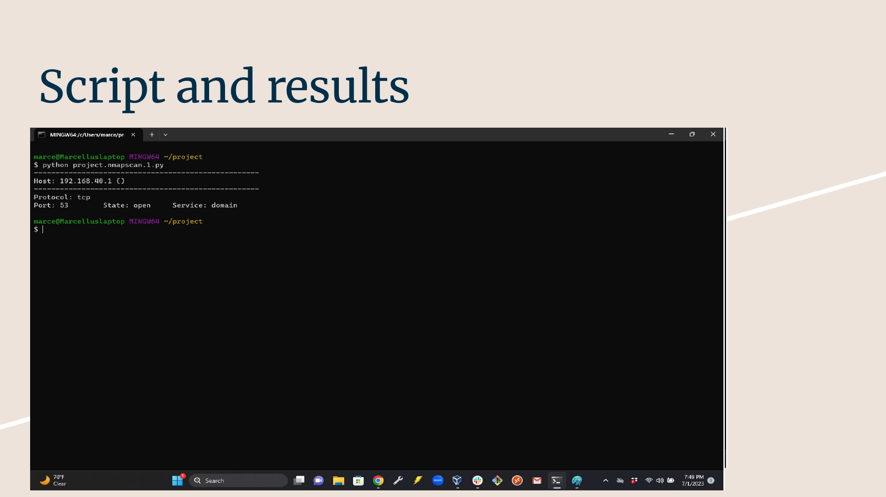

# Automated Port Scanner & Vulnerability Assessment

**Live Demo:** [View the demo here](https://marcellusharris.github.io/automated-port-scanner/)

[](https://www.python.org/)
[](LICENSE)
[](#)
[](#)

This project presents a Python-based port scanning tool designed to discover open ports on a target system. It uses the `nmap` Python module to identify active services and analyze potential vulnerabilities. This project was presented at BootCon in front of over 300 attendees and demonstrates how attackers might probe networked devices.

---

## Objective

To develop a Python script that automates the process of scanning open ports and assists in basic vulnerability assessment. It highlights common weaknesses and educates users about the importance of securing exposed services.

---

## Features

- **Fast TCP scanning:** Uses `python-nmap` to quickly scan a range of ports.
- **Vulnerability awareness:** Parses `nmap` script results to flag known vulnerable services.
- **Interactive CLI:** Simple terminal interface for specifying targets and port ranges.
- **Covert DNS C2 demo:** Demonstrates DNS-based command and control using the `dnsat2` tool.
- **Real‑world simulation:** Tested on devices like Raspberry Pi to model attacker behavior.
- **Defensive insights:** Offers recommendations for IDS, firewall, and segmentation strategies.
- **Visual demo:** Includes a screenshot of the scan results and analysis for clarity.

---

## Installation

You’ll need Python 3.11+ and `python-nmap`:

```bash
pip install python-nmap
```

---

## Usage

Run the scanner with a target IP and optional port range:

```bash
python scanner.py -t 192.168.1.10 -p 20-1024
```

The tool will perform the scan, highlight any services with known vulnerabilities, and display a summary of findings.

---

## Demo Output

Here’s a sample output from scanning a local device:



---

## Vulnerability Assessment

After completing a port scan, the tool analyzes the service banners and `nmap` script results to identify high‑risk services, such as outdated SSH/FTP versions or exposed databases. It then provides a brief summary of potential CVEs and mitigation steps.

## Potential Threats & Mitigations

| Threat | Description | Mitigation |
|-------|-------------|-----------|
| **Port enumeration by attackers** | Malicious actors can discover open ports and exploit weak services. | Use firewalls to restrict access; implement service whitelists. |
| **Unpatched services** | Outdated software may contain critical vulnerabilities. | Regularly update/patch services; monitor CVE feeds. |
| **Weak authentication** | Default credentials or weak passwords allow unauthorized access. | Enforce strong passwords and multi‑factor authentication. |
| **Insufficient network segmentation** | Flat networks allow lateral movement after initial compromise. | Segment networks and apply least‑privilege access controls. |

---

## License

This project is licensed under the MIT License. See the [LICENSE](LICENSE) file for more details.
